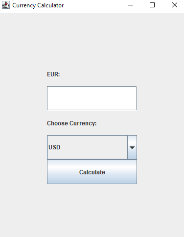
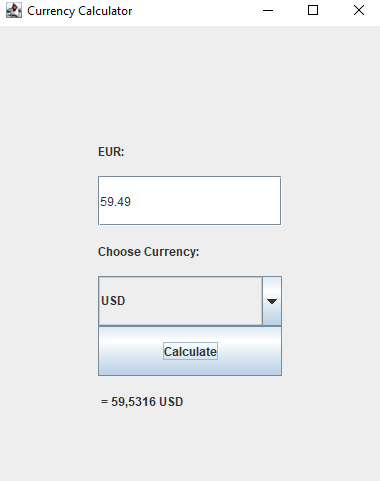

# Currency calculator
> Currency calculator is a simple tool to quickly and easly convert value from euro to any desired currency. 

## Table of Contents
* [General Info](#general-information)
* [Libraries](#libraries)
* [Screenshots](#screenshots)

## General Information

The calculator uses the http://www.ecb.europa.eu/stats/eurofxref/eurofxref-daily.xml file to get currencies and their rates for the calculations.
To get data from the xml, a Document Object Module parser has been used in the Parser class.
All methods have been tested with unit tests - I used JUnit 5 for tests.
Program has been created on jdk-1.8

To use the calculator, simply type in any price in eur and choose a deisred currency from the list. 

## Libraries
Libraries outside of jdk:
- Swing 
- DecimalFormat
- DocumentBuilderFactory
- org.w3c.dom 
- awt

## Screenshots

